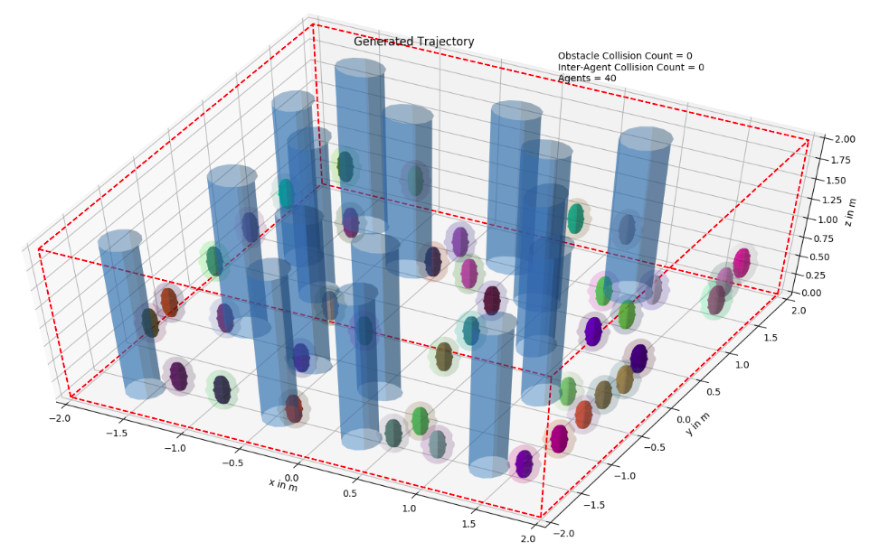

# AMSwarm Repository 

Repository associated with paper titled "AMSwarm: An Alternating Minimization Approach for Safe Motion Planning of Quadrotor Swarms in Cluttered Environments", to be presented at IEEE ICRA 2023.

### What's included

* Codes: 
    * Proposed Distributed Alternating Minimizatiom (AM) based approach
    * Distributed Sequential Convex Programming (SCP) with Continuous Collision Avoidance [1] and On-demand Collision Avoidance [2].
    * Distributed Trajectory Optimization with Optimal Control Solver ACADO [3] (incorporating discrete-time Barrier Function constraints)
* Supplementart Material:
    * Detailed experimental setup

### Simulation Environment Example

  
_Fig. 40 quadrotors in a forest-like cluttered environment. Dark-colored ellipsoids are quadrotors and light-colored ellipsoids are respective goals of each quadrotor. Red-dashed lines represent a workable space, and tall blue cylinders are static obstacles._

### References
[1] Soria, Enrica, Fabrizio Schiano, and Dario Floreano. "Distributed Predictive Drone Swarms in Cluttered Environments." IEEE Robotics and Automation Letters 7.1 (2021): 73-80.    
[2] Luis, Carlos E., Marijan Vukosavljev, and Angela P. Schoellig. "Online trajectory generation with distributed model predictive control for multi-robot motion planning." IEEE Robotics and Automation Letters 5.2 (2020): 604-611.  
[3] Houska, Boris, Hans Joachim Ferreau, and Moritz Diehl. "ACADO toolkit—An open‐source framework for automatic control and dynamic optimization." Optimal Control Applications and Methods 32.3 (2011): 298-312.
